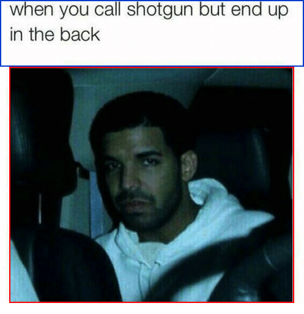
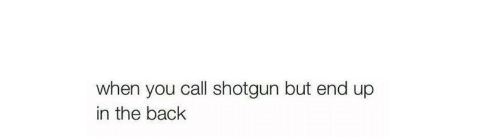

# meme-text-ocr
Applies Tesseract Optical Character Recognition on an image of text taken from a meme.

### Motivation:

In a [previous project](https://github.com/evmarts/meme-cropper), memes were partitioned into a text component and an image component: 

We may want to convert the text component into a string so that we can reuse, modify or analyze it. The meme-text-ocr.py script recognizes the text in an image of text:

### meme-text-ocr.py

Prompts user for an image of text:

~~~
$ python meme-text-ocr.py
Image of text to recognize: in/text.jpg
~~~

 text.jpg

Outputs the following

~~~
Text recognized as: 'When you call shotgun but end up in the back'
~~~