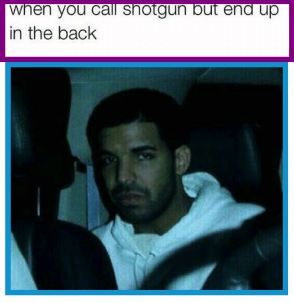
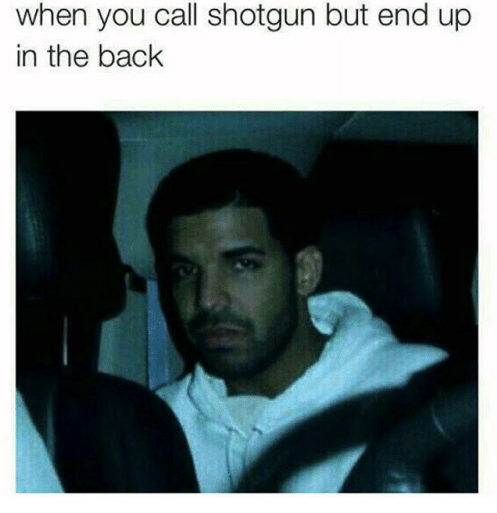
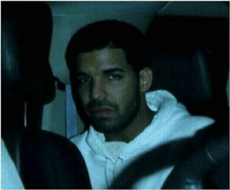

# meme-text-ocr

The goal of this project is to recognize a string of text in an image of text.

## Motivation

In a [previous project](https://github.com/evmarts/meme-cropper), images of memes were partitioned into a text component and an image component: 



We may want to convert the text component into a string so that we can reuse, modify or analyze it. 

## Getting Started

Follow the instructions [here](https://github.com/tesseract-ocr/tesseract/wiki) to install tesseract optical character recognition.

Clone:
```git clone https://github.com/evmarts/meme-text-ocr.git```

Run the script:
```python meme-text-ocr.py```

### Prerequisites

- Python

- tesseract ocr

## Built With

* [tesseract ocr](https://github.com/tesseract-ocr/tesseract) - The optical character recognition engine used

* Python Imaging Library (PIL)

## Examples

Suppose we have the following meme:



Assume we have [some way](https://github.com/evmarts/meme-cropper) of partition the memes into two components:

A text component and an image component:

 

After placing the image of the text in the ```in/``` directory, we can run the script:

~~~
evmarts$ python meme-text-ocr.py
Image of text to recognize: in/text.jpg
~~~

The script then outputs the following: 

~~~
Text recognized as: 'When you call shotgun but end up in the back'
~~~

## Authors

Evan Martin
